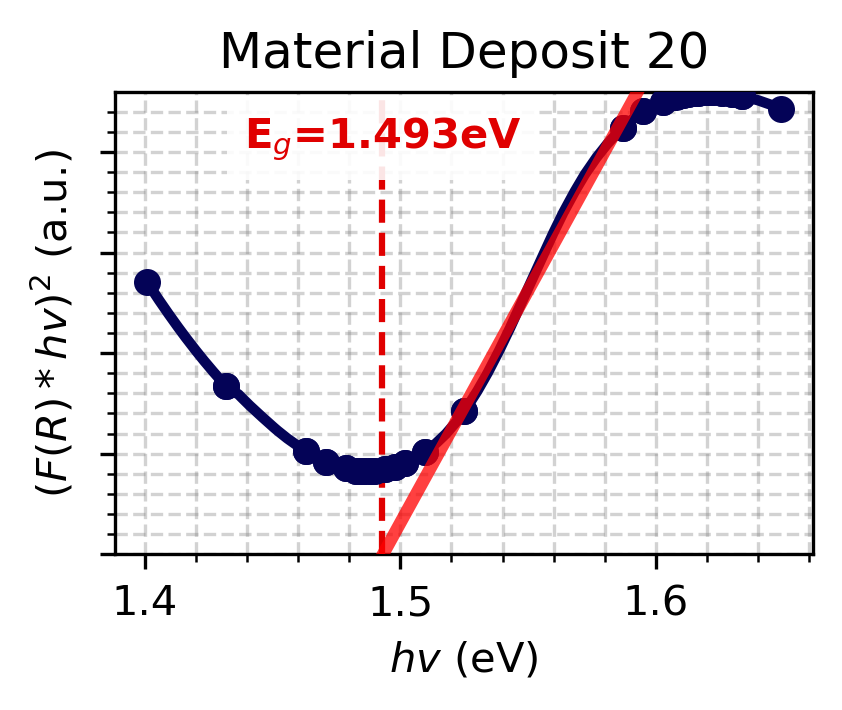
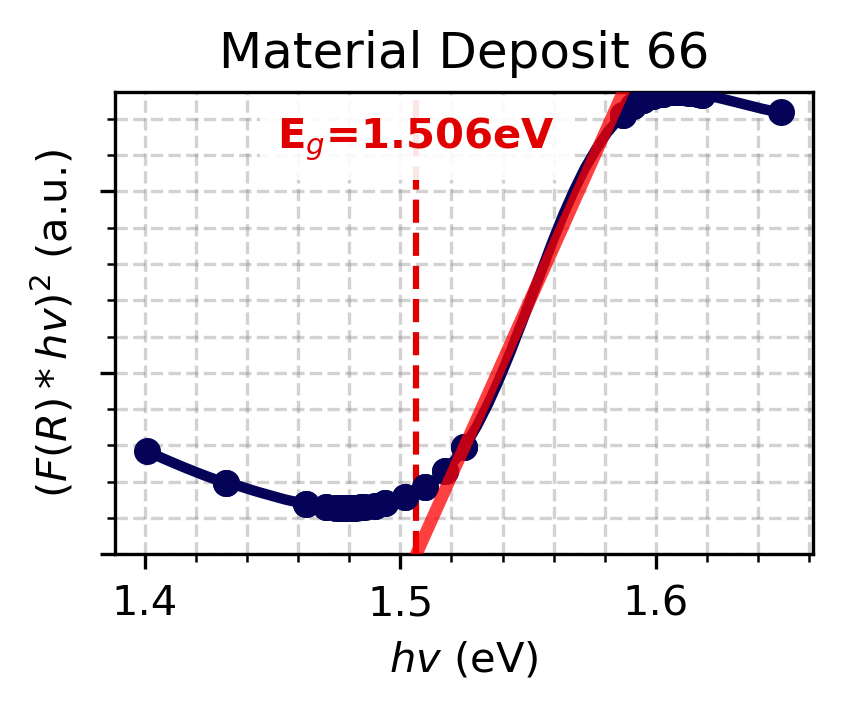

# Automatic-Band-Gap-Extractor
______________________________________________

# Table of Contents
- [Package Description](#description)
- [Installation](#installation)
- [Usage](#usage)

# Description:

This package automatically extracts the direct band gap from an array of multiple measured reflectance spectra samples.

**Steps for Extracting Band Gap:**

- Compute Tauc plots from reflectance for each spectra.
- Each Tauc plot is smoothed using a Savitzky–Golay filter to reduce signal noise.
- The smoothed curves are processed into line segmented using a recursive segmentation process. This process segmements the smoothed curve in half recursively into smaller line segments until each line segment has a fit of $R^2 \geq 0.990$ with its respective curve segment.
- The peak locations of the Tauc plot are extracted after an extreme Savitzky–Golay smoothing filter is applied to locate the upper-bound for linear regression fitting in the next step.
- A linear regression across the entire Tauc plot range is fit for every n and n+1 pair of line segments. The regression lines that have a positive slope, intersect with the x-axis, and have the lowest RMSE with the Tauc plot between the x-intercept and the next Tauc plot peak are the regression lines used to compute band gap.
- Band gaps are extracted from the x-intercepts of the regression lines computed in the previous step.

# Installation

Package installation requirements can be found in the [requirements.txt](./requirements.txt) file.

# Usage

A demonstration of using the automatic band gap extractor package can be found in the [example.ipynb](./example.ipynb) file. The automatic band gap extractor code itself can be found in the [extractor.py](./extractor.py) file under the `autoextract()` definition.

Input data should take the form a `.hdr` and `.bil` file, measured by a hyperspectral camera. We provide a test dataset in the [example.ipynb](./example.ipynb) file. Our reflectance spectra are measured using a [Resonon Pika L](https://resonon.com/Pika-L) hyperspectral camera that has a 10,000 point scaling factor for reflectance intensity. Hence, to convert these reflectance spectra from 10,000 percentage points to a decimal $\in [0,1]$, we set `autoextract(intensity_scale=10000)`.

Once the data files are input, the user must only define a set of crop/rotation parameters to set the vision-segmentation boundaries. The rotate/crop parameters the the form of a dictionary: `rotate_crop_params = {'theta': -0.5, 'x1': 45, 'x2': 830, 'y1': 120, 'y2': 550}`, where `theta` defines the rotation, `x1` and `x2` define the x-limits, and `y1` and `y2` define the y-limits. 

After providing the data files paths and the crop/rotation parameters, the [vision.py](./vision.py) and the [extractor.py](./extractor.py) will automatically segment all samples and compute the band gap of each sample, outputting an band gap plot for each sample, as shown below. A `.csv` file of the computed band gaps for each sample are also provided as an output.

| Example #1| Example #2 |
| ---------- | ----------- |
|  |  |

