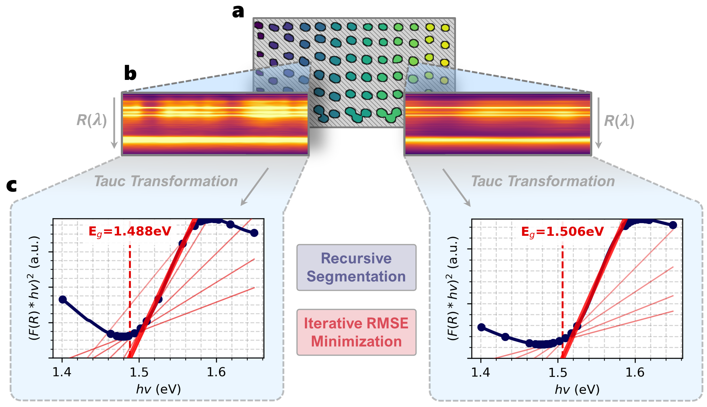
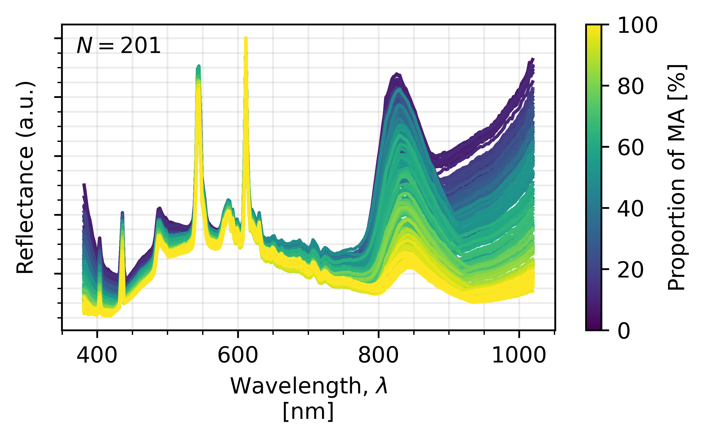
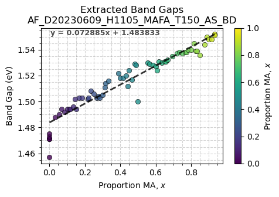
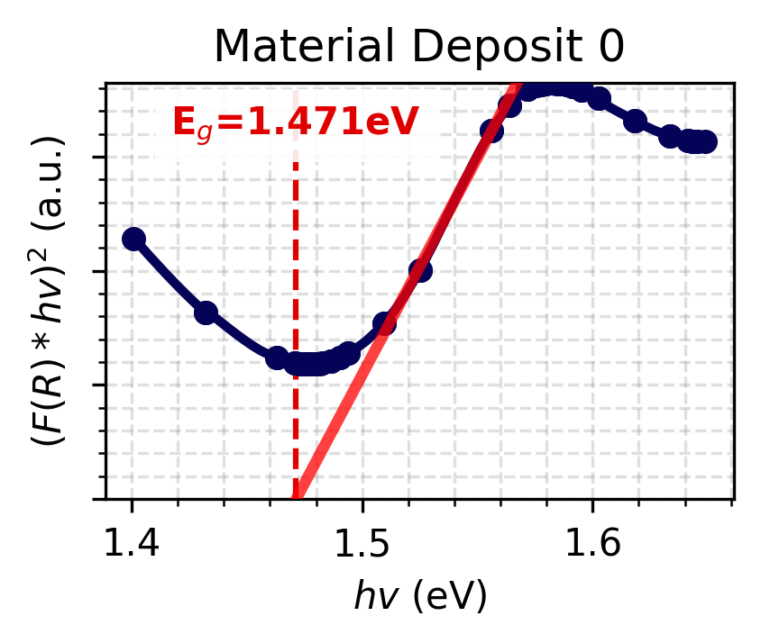
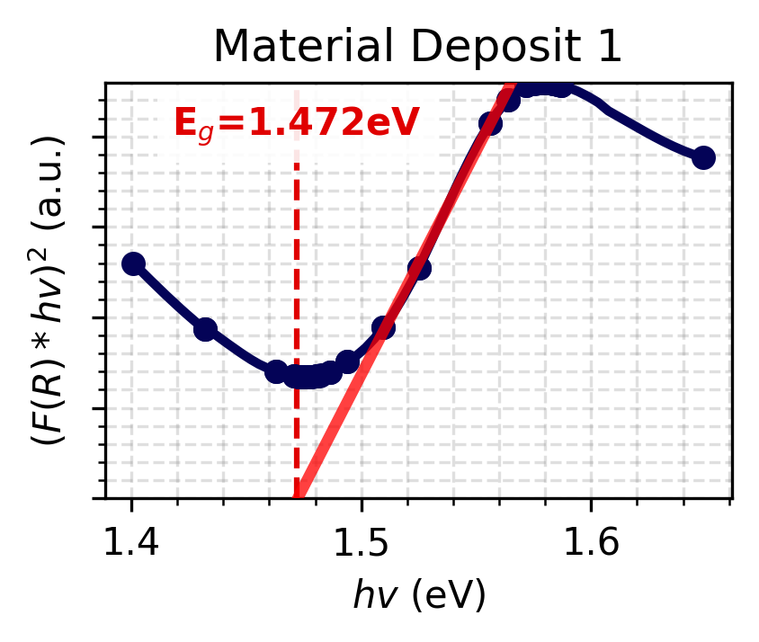

# Autocharacterization-Bandgap
______________________________________________

# Table of Contents
- [Package Description](#description)
- [Installation](#installation)
- [Usage](#usage)

# Description:

This package automatically extracts the direct band gap from an array of multiple measured reflectance spectra samples. The package allows for rapid band gap extraction for an array of materials, thus speeding up characterization in the materials discovery workflow. 

This package was made for materials printed using a High-Throughput (HT) Combinatorial Synthesis system called Archerfish (AF) built at MIT in the Accelerated Materials Development for Sustainability Lab under PI Tonio Buonassisi. However, this package uses various computer vision methods that allow it to be adaptible to other materials systems of different form factors. The only component of the code specific to the HT synthesis platform is the composition extraction, however, this is a non-crtical part of the code that will not affect the band gap results. 

The author of this package is Alexander E Siemenn (PhD in Mechanical Engineering MIT Starting class of 2019), for any questions regarding the package or how to use it please contact the Accelerated Materials Development for Sustainability Lab.   

# How to Cite
Please cite our paper if you use this code:

    @article{siemenn2024using,
    title={Using scalable computer vision to automate high-throughput semiconductor characterization},
    author={Siemenn, Alexander E and Aissi, Eunice and Sheng, Fang and Tiihonen, Armi and Kavak, Hamide and Das, Basita and Buonassisi, Tonio},
    journal={Nature Communications},
    volume={15},
    number={1},
    pages={4654},
    year={2024},
    publisher={Nature Publishing Group UK London}
    }

| Folders | Description |
| ------------- | ------------------------------ |
|[Bandgap](./BandGap) | An empty folder that will be populated with:, the Tauc plots for each material, a csv of the computed bang gaps, an image of the composition mapping for the materials, the extracte reflectance spectra for all materials, a figure of band gap vs composition of the materials, the cropped image of the materials, the results of the vision segmentation algorithm|
|[data](./data) | A folder that will store the downloaded example data (FAMAPbI.bil & FAMAPbI.hdr) and must have the following files:  gcode_XY.csv is a file with gcode used to extract sample compositions, motor_speeds.txt is a file with motor speeds used to extract sample compositions, wavelength.txt is a text file used to extract the materials' band gap|
|[HS](./HS) | A folder with an images explaining the bandextractor algorithm and will be populated with spectra_sorted.csv,  a file with the spectral data for each material|

| Files | Description |
| ------------- | ------------------------------ |
|[main.py](./main.py)|  A python file to perform automatic band gap extraction on the example data|
| [examples.ipynb](./examples.ipynb) | A python notebook with an example data set to explain how to use this package|
|[vision.py](./vision.py)| A file with the vision segmentation algorithms used to identify the material samples regardless of form factor|
|[bandextractor.py ](./bandextractor.py )| A file with function used to extract AF material compositions|
|[compextractorb.py](./compextractorb.py)|  A file with function used to extract AF material compositions|
|[requirements.txt](./compextractorb.py)|  a text file with all the necessary libraries to use this package|

**How the Band Gap Extraction Algorithm Works:**

- Compute Tauc plots from reflectance for each spectra.

- Each Tauc plot is smoothed using a Savitzky–Golay filter to reduce signal noise.
- The smoothed curves are processed into line segmented using a recursive segmentation process. This process segments the smoothed curve in half recursively into smaller line segments until each line segment has a fit of $R^2 \geq 0.990$ with its respective curve segment.
- The peak locations of the Tauc plot are extracted after an extreme Savitzky–Golay smoothing filter is applied to locate the upper-bound for linear regression fitting in the next step.
- A linear regression across the entire Tauc plot range is fit for every n and n+1 pair of line segments. The regression lines that have a positive slope, intersect with the x-axis, and have the lowest RMSE with the Tauc plot between the x-intercept and the next Tauc plot peak are the regression lines used to compute band gap.
- Band gaps are extracted from the x-intercepts of the regression lines computed in the previous step.

# Installation

Package installation requirements can be found in the [requirements.txt](./requirements.txt) file.

# Usage

## Quick Start on Example Data 

A demonstration of using the automatic band gap extractor package can be found in the [example.ipynb](./example.ipynb) file. The automatic band gap extractor code itself can be found in the [bandextractor.py](./bandextractor.py) file under the `autoextract()` definition.

A quicker demonstration can be obtained by using the main.py file. The user only needs to run the file and the example data will be automatically analysed. 

## For Other Applications 

Input data should take the form `.hdr` and `.bil` file, measured by a hyperspectral camera. We provide a test dataset in the [example.ipynb](./example.ipynb) file. Our reflectance spectra are measured using a [Resonon Pika L](https://resonon.com/Pika-L) hyperspectral camera that has a 10,000 point scaling factor for reflectance intensity. Hence, to convert these reflectance spectra from 10,000 percentage points to a decimal $\in [0,1]$, we set `autoextract(intensity_scale=10000)`.

Once the data files are input, the user must define a set of crop/rotation parameters to set the vision-segmentation boundaries. The rotate/crop parameters take the form of a dictionary: `rotate_crop_params = {'theta': -0.5, 'x1': 45, 'x2': 830, 'y1': 120, 'y2': 550}`, where `theta` defines the rotation, `x1` and `x2` define the x-limits, and `y1` and `y2` define the y-limits. 

For composition extraction, if the user is analyzing materials created using a HT synthesis system such as AF, they will be required to define a set of parameters to align the print pattern to the location of the droplets in order to obtain a good composition extraction. If the material system takes another form however, the functions in vision.py and bandextractor.py can be adapted to fit the new application. 

After providing the paths for the data files and the crop/rotation parameters, the [vision.py](./vision.py) and the [bandextractor.py](./bandextractor.py) will automatically segment all samples and compute the band gap of each sample, outputting a band gap plot for each sample, as shown below. A `.csv` file of the computed band gaps for each sample are also provided as an output in the Bandgap folder under the name Extracted_Band_Gaps.csv. 

| Example #1| Example #2 |
| ---------- | ----------- |
|  |  |

